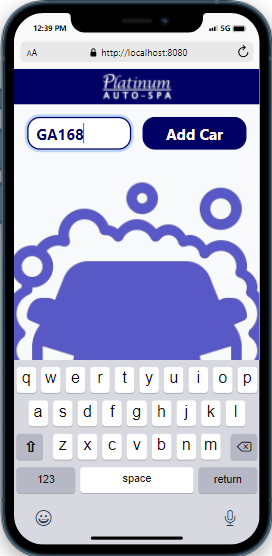
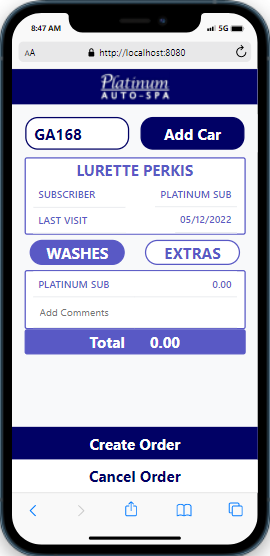
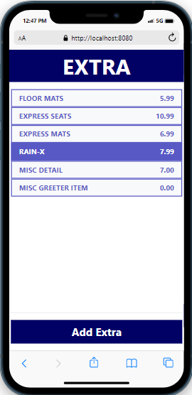
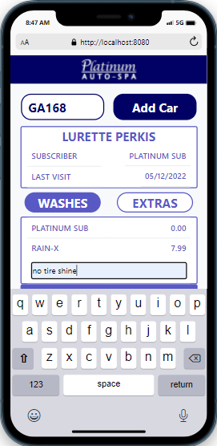
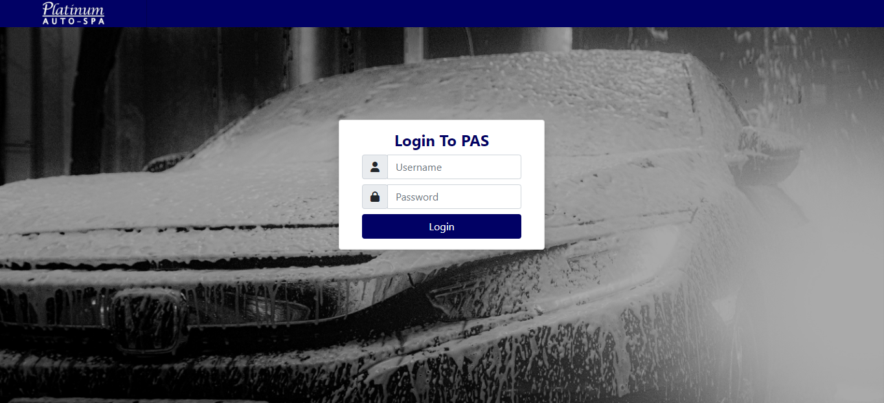
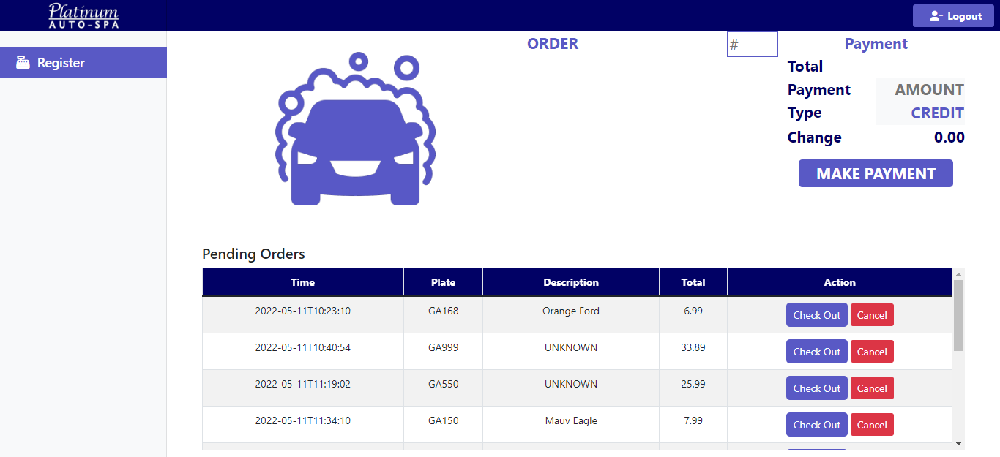
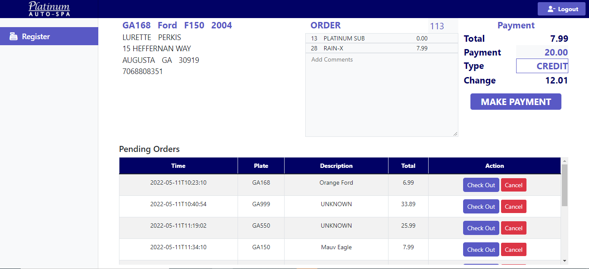
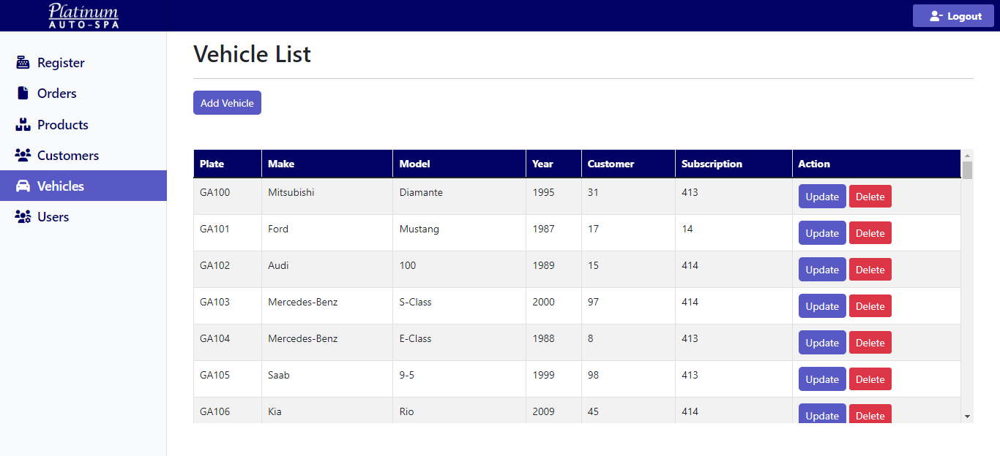
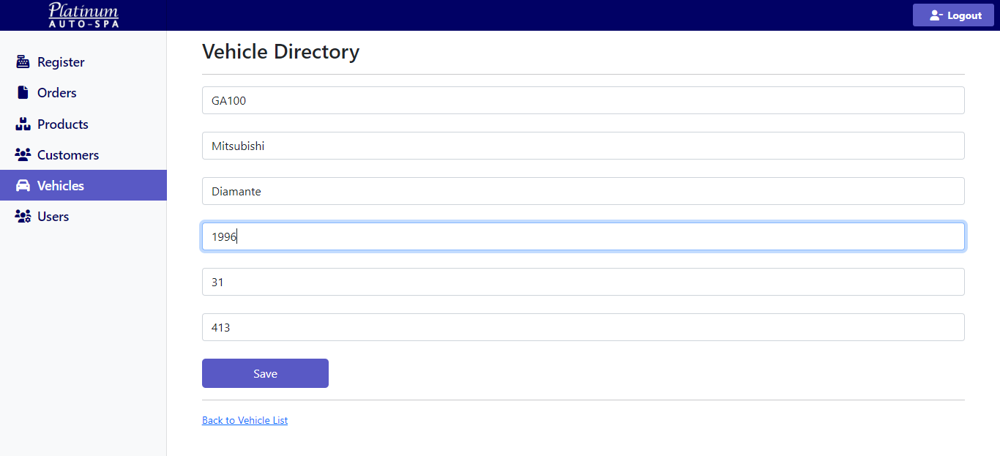

<p align="center">

</p>

<p align="center">
<h1>Car Wash Management System</h1>
<h4>CRM and POS system for Platinum Auto Spa</h4>
</p>

<p align="center">
<a href="https://github.com/burrorc/cms" target="blank">

</a>
<a href="https://github.com/burrorc/cms/issues" target="blank">

</a>
<a href="https://github.com/burrorc/cms" target="blank">

</a>
</p>

## 🛠️ Installation

1. Clone the repository by running this command in terminal

```bash
  git clone https://github.com/burrorc/cms.git
```

2. Change the working directory

```bash
cd cms
```

3. Update the maven project in your IDE
4. Create db schema using createDB.sql script in repo home folder

## 🧐 How to use

### Greeter Section

1. Navigate to `url/greeter/order` (pre-filled with GA prefix, but can be edited).
  <p align="center">
   
  </p>
2. Enter License Plate Number(members and previous visits pulled from db).
   <p align="center">
   
  
  </p>
3. Select Wash Option and add any Extras.
  <p align="center">
   
  </p>
4. Add Comments if needed.
   <p align="center">
   
  </p>

5. Click Create Order.

### Cashier Section

1. Navigate to home url.
2. Log in.
   <p align="center">
   
  </p>

3. Enter order number(scan, select from pending order list, or manually).
   <p align="center">
   
  </p>

4. Enter payment amount.
5. Select payment type.
    <p align="center">
   
  </p>
6. Complete Order

### Admin

1. Navigate to home url.
2. Log in.

3. Select items to view/edit/add from left menu.
    <p align="center">
   
  </p>
4. Add or make edits.
    <p align="center">
   
  </p>

## 💻 Tech Stack

- [Java 8](https://www.oracle.com/java/technologies/java8.html)
- [MySQL](https://www.mysql.com/)
- [Spring Boot](https://spring.io/projects/spring-boot)
- [Spring Boot Data JPA](https://spring.io/guides/gs/accessing-data-jpa/)
- [Spring Security](https://spring.io/projects/spring-security/)
- [Thymeleaf](https://www.thymeleaf.org/)

## 🤞 Scope of Improvements

- Customize edit forms
- Add search functionality
- Add employee time clock
- Add metrics
- Labor rate
- Connect employees to sales figures
- Avg ticket price
- Daily totals
- Update db schema as new functionality is added

## 🙇 Author

Developed with ❤️ by [@burrorc](https://github.com/burrorc)
